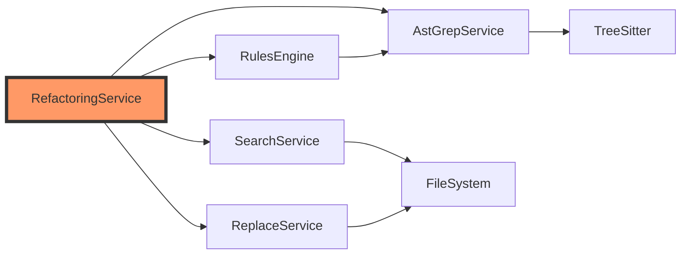

# Refactoring System Integration Plan

## Overview
This document outlines how the refactoring system integrates with existing ast-grep MCP services.

## Integration Points

### 1. SearchService Integration
- **Purpose**: Find patterns for refactoring
- **Usage**: 
  - Pattern validation
  - Match discovery across files
  - Scope analysis for references
- **Interface**:
  ```rust
  // RefactoringEngine uses SearchService
  let matches = search_service.search_files(FileSearchParam {
      pattern: refactoring.pattern.match,
      language: language.clone(),
      path_pattern: options.path_pattern,
      ..Default::default()
  }).await?;
  ```

### 2. ReplaceService Integration
- **Purpose**: Apply transformations
- **Usage**:
  - Execute refactoring transformations
  - Generate diffs for preview
  - Apply changes to files
- **Interface**:
  ```rust
  // TransformationEngine uses ReplaceService
  let result = replace_service.replace_in_files(FileReplaceParam {
      pattern: refactoring.pattern.match,
      replacement: transformation,
      language: language.clone(),
      dry_run: options.preview,
      ..Default::default()
  }).await?;
  ```

### 3. AstGrepService Integration
- **Purpose**: AST analysis and validation
- **Usage**:
  - Validate syntax of transformations
  - Analyze scope and dependencies
  - Extract node information
- **Interface**:
  ```rust
  // ValidationEngine uses AstGrepService
  let ast = ast_grep_service.parse_code(code, language)?;
  let node_info = ast_grep_service.analyze_node(ast, pattern)?;
  ```

### 4. Rules System Integration
- **Purpose**: Complex refactoring logic
- **Usage**:
  - YAML-based refactoring definitions
  - Conditional transformations
  - Multi-step refactorings
- **Interface**:
  ```rust
  // RefactoringCatalog can load from YAML rules
  let rule = RuleConfig::from_yaml(&refactoring_yaml)?;
  let engine = RefactoringEngine::from_rule(rule)?;
  ```

## Service Dependencies



## Tool Registration

The refactoring system adds two new MCP tools:

### 1. `refactor` Tool
```typescript
{
    name: "refactor",
    description: "Apply structured refactorings like extract method, rename symbol, etc.",
    inputSchema: {
        type: "object",
        properties: {
            refactoring_id: { type: "string" },
            pattern_example: { type: "string" },
            options: { type: "object" }
        },
        required: ["refactoring_id"]
    }
}
```

### 2. `validate_refactoring` Tool
```typescript
{
    name: "validate_refactoring",
    description: "Validate a refactoring pattern against test code",
    inputSchema: {
        type: "object",
        properties: {
            refactoring_id: { type: "string" },
            test_code: { type: "string" },
            language: { type: "string" }
        },
        required: ["refactoring_id", "test_code", "language"]
    }
}
```

## Configuration

Refactoring definitions are stored in:
```
refactorings/
├── extract_method.yaml
├── extract_variable.yaml
├── rename_symbol.yaml
├── inline_variable.yaml
├── guard_clause.yaml
├── extract_class.yaml
├── loop_to_pipeline.yaml
├── consolidate_conditional.yaml
├── magic_number_to_constant.yaml
└── parameter_object.yaml
```

## Error Handling

The refactoring system follows existing error patterns:
- Uses `AstGrepError` for consistency
- Provides detailed error messages for LLM consumption
- Includes warnings for potentially unsafe transformations

## Performance Considerations

1. **Lazy Loading**: Refactoring definitions loaded on-demand
2. **Caching**: Pattern compilation cached per session
3. **Batch Processing**: Multiple files processed in parallel
4. **Token Efficiency**: Responses use summary format by default

## Migration Path

1. **Phase 1**: Core infrastructure (types, catalog, engine)
2. **Phase 2**: Basic refactorings (extract variable, rename)
3. **Phase 3**: Method extraction refactorings
4. **Phase 4**: Complex refactorings (extract class, parameter object)
5. **Phase 5**: Language-specific optimizations